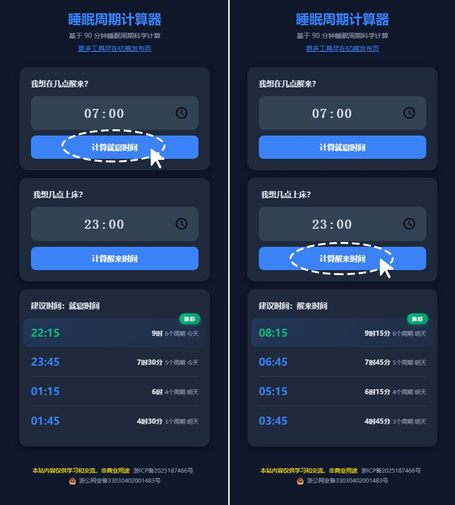

# 睡眠周期计算器

基于 90 分钟睡眠周期科学计算

演示地址： [https://sleepcycle.937788.xyz/](https://sleepcycle.937788.xyz/)

## 功能介绍

### 1. 计算就寝时间
输入您希望醒来的时间，计算最合适的就寝时间。

- 输入：期望醒来时间
- 输出：3-6个睡眠周期的建议就寝时间

### 2. 计算醒来时间
输入您计划上床的时间，计算最合适的醒来时间。

- 输入：计划上床时间
- 输出：3-6个睡眠周期的建议醒来时间

## 技术参数

| 参数 | 值 | 说明 |
|------|-----|------|
| 睡眠周期 | 90 分钟 | 科学推荐的睡眠周期长度 |
| 入睡缓冲 | 15 分钟 | 入睡前所需的准备时间 |
| 推荐周期数 | 3-6 个 | 最佳睡眠周期范围 |

## 睡眠周期说明

- **3个周期**：4.5小时睡眠（快速恢复）
- **4个周期**：6小时睡眠（标准睡眠）
- **5个周期**：7.5小时睡眠（推荐睡眠）
- **6个周期**：9小时睡眠（充足睡眠）

## 使用方法

### 场景一：我想在几点醒来？
1. 输入您希望醒来的时间
2. 点击"计算就寝时间"按钮
3. 系统会显示3-6个周期的建议就寝时间

### 场景二：我想几点上床？
1. 输入您计划上床的时间
2. 点击"计算醒来时间"按钮
3. 系统会显示3-6个周期的建议醒来时间

---

**免责声明**：本站内容仅供学习和交流，非商业用途

